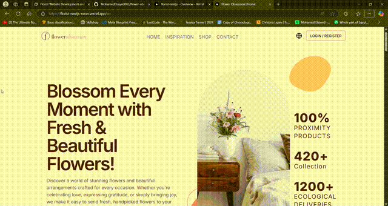

## Flower Obsession

Flower Obsession is a modern e-commerce web app for a florist business. Users can browse curated bouquet collections, add products to favorites and cart, place orders with cash or Stripe checkout, and manage their profiles. An admin dashboard provides rich analytics on revenue, products, and operations. The app is fully localized in Arabic and English.



### Live
- Arabic: florist-nextjs-neon.vercel.app/ar

## Table of Contents

- Features
- Screens and Routes
- Tech Stack
- Architecture
- Getting Started
  - Prerequisites
  - Installation
  - Environment Variables
  - Run Locally
- Internationalization
- Authentication and Middleware
- Payments (Stripe)
- Admin Dashboard
- Project Structure
- Deployment
- Contributing
- License
- Contact

## Features

- User authentication: Register, login, forgot/reset/verify password flows
- Auth protection: Middleware guarding `cart`, `favorite`, `checkout`, `profile`, `orders`, `admin`
- Product browsing: Home, Shop with search and infinite scroll, Inspiration
- Product details: SEO-friendly product pages via `slug`
- Cart and favorites: Add/update/remove, quantity updates, persistence via API
- Checkout: Cash on delivery and Stripe checkout redirect
- Orders: Order history for users
- Profile: Edit name and phone
- Admin dashboard: Revenue analytics, product analytics, operational and seasonal metrics, business insights
- Internationalization: `en` and `ar` with locale-aware routing
- Performance UX: React Query caching, optimistic updates, and toasts
- Modern UI: Tailwind CSS + shadcn/ui components, responsive design, dark mode ready

## Screens and Routes

Localized routes live under `/[locale]` where `locale` is `en` or `ar`.

- Public:
  - `/(en|ar)`: Home
  - `/(en|ar)/shop`: Shop with search
  - `/(en|ar)/inspiration`: Inspiration gallery
  - `/(en|ar)/contact`: Contact
  - `/(en|ar)/[...rest]`: Marketing/static

- Auth:
  - `/(en|ar)/login`, `/(en|ar)/register`
  - `/(en|ar)/forgot-password`, `/(en|ar)/complete-profile`

- Protected:
  - `/(en|ar)/cart`, `/(en|ar)/favorite`
  - `/(en|ar)/checkout`
  - `/(en|ar)/orders`, `/(en|ar)/profile`
  - `/(en|ar)/admin`

## Tech Stack

- Framework: Next.js 14 (App Router), React 18, TypeScript
- State & Data: Zustand, @tanstack/react-query
- i18n: next-intl with middleware-based locale routing
- UI: Tailwind CSS, shadcn/ui (Radix primitives), lucide-react, framer-motion
- Payments: Stripe (redirect checkout)
- Notifications: sonner
- Backend: NestJS API (`process.env.API`) with MongoDB
- Deployment: Vercel

## Architecture

- App Router with segmented layouts: `app/[locale]/(auth|dashbard)` groups
- Locale-aware routing and middleware: `i18n/routing.ts`, `middleware.ts`
- API access via server actions: `utils/actions/index.ts`
- Global user store: `store/userStore.ts` hydrated via `utils/providers/client-provider.tsx`
- Data fetching and caching hooks: `hooks/index.ts`
- UI components organized by domain: `components/*`

Key flows:
- Auth: JWT token stored in `access_token` cookie; middleware blocks/redirects
- Cart/Favorites/Orders: Authenticated fetches to API with Bearer token
- Checkout:
  - Cash: `createOrder` posts address and creates order
  - Stripe: `orderStripe` creates a session on backend and redirects to Stripe URL

## Getting Started

### Prerequisites

- Node.js v18+
- npm, Yarn, pnpm, or Bun

### Installation

```bash
git clone https://github.com/MohamedElsayed002/flower-obession-nextjs.git
cd flower-obession-nextjs
npm install
# or: yarn install / pnpm install / bun install
```

### Environment Variables

Create a `.env` file in the project root:

```env
# Backend API base URL
API=https://florist-nestjs.vercel.app

# Stripe (Checkout uses backend; publishable key is used client-side as needed)
NEXT_PUBLIC_STRIPE_PUBLISHABLE_KEY=your_publishable_key
STRIPE_SECRET_KEY=your_secret_key
```

### Run Locally

```bash
npm run dev
# or: yarn dev / pnpm dev / bun dev
```

Then open `http://localhost:3000`.

## Internationalization

- Locales: `en`, `ar` configured in `i18n/routing.ts`
- Middleware applies locale and rewrites to the correct segment
- Locale utilities: `i18n/routing.ts` exports `Link`, `useRouter`, `usePathname`, etc.
- Toggle in UI: `components/common/toggle-locale.tsx`

## Authentication and Middleware

- Middleware reads `access_token` from cookie or `Authorization` header
- Blocks access to protected routes when unauthenticated; redirects to `/{locale}/login`
- Prevents authenticated users from visiting login/register/forgot-password; redirects to `/{locale}`
- User profile hydration runs globally in `client-provider.tsx` via Zustand store

## Payments (Stripe)

- Stripe checkout is initiated with `orderStripe({ lang })`
- The backend creates a Checkout Session and returns `url`; client redirects
- Cash orders are supported via `createOrder({ street, city, phone })`

## Admin Dashboard

Available to authenticated users with admin permissions (checked by backend). The dashboard surfaces:
- Enhanced admin stats
- Revenue analytics
- Product analytics
- Operational metrics
- Seasonal analytics
- Business insights

Data hooks live in `hooks/index.ts` and call server actions in `utils/actions/index.ts`.

## Project Structure (excerpt)

```text
app/
  [locale]/(auth|dashbard)/...
components/
  admin/, cart/, checkout/, common/, favorite/, footer/, home/, navbar/, profile/, shop/, single-product/, ui/
hooks/
  auth/*, index.ts
i18n/
  messages/en.json, ar.json, routing.ts
store/
  userStore.ts
utils/
  actions/*, providers/*, types/*
```

## Scripts

```bash
npm run dev       # Start dev server
npm run build     # Build for production
npm run start     # Start production server
npm run lint      # Lint
npm run lint:fix  # Lint and fix
```

## Deployment

Deployed on Vercel. To deploy your own instance:
1. Push to a GitHub repo
2. Import the repo in Vercel
3. Set required environment variables (`API`, Stripe keys)
4. Deploy

## Contributing

Contributions are welcome!
1. Fork the repo
2. Create a feature branch: `git checkout -b feat/awesome`
3. Commit: `git commit -m "feat: add awesome"`
4. Push and open a PR

## License

MIT

## Contact

- GitHub: MohamedElsayed002
- LinkedIn: Mohamed Elsayed (linkedin.com/in/mohamedelsayed2002/)
